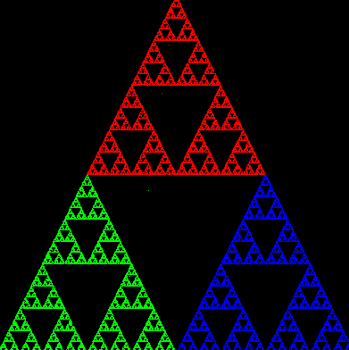
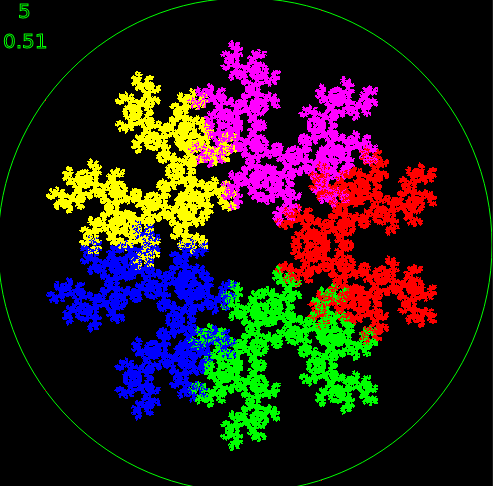
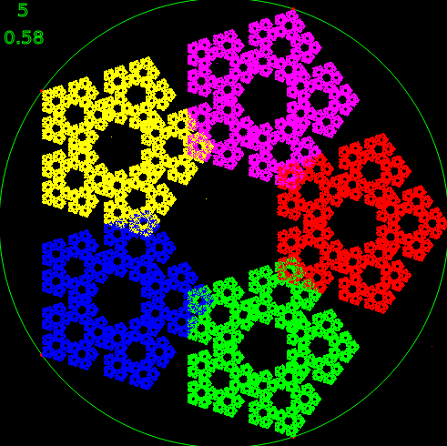
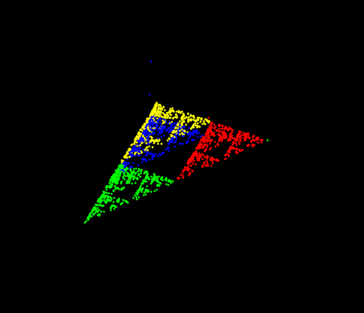
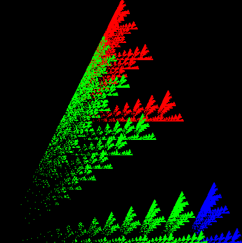

# chaos-game
The Chaos Game in processing 3 and p5js

[simple Chaos Game](https://editor.p5js.org/greggelong/sketches/rJbJBnv2C)

The last couple days I have been doing some coding and math review in the yard with the dogs. While reading 'Fractals: a graphic guide', I came across the Chaos game. I had never tried to code it and thought it would be a nice distraction.  I think it is refreshing to do some math and code stuff in the sun, on paper around the dogs. It is a nice change from a dark room while everyone else is sleeping. I coded on my android in processing3 using APDE. Later at home I refactored it to p5.js on a laptop. I also consulted some youtube videos #thecodingtrain and #numberphile. #creativecoding #fractal

Instructions from [Wikipedia](https://en.wikipedia.org/wiki/Chaos_game):

>The fractal is created by iteratively creating a sequence of points, starting with the initial random point, in which each point in the sequence is a given fraction of the distance between the previous point and one of the vertices of the polygon; the vertex is chosen at random in each iteration. Repeating this iterative process a large number of times, selecting the vertex at random on each iteration, and throwing out the first few points in the sequence, will often (but not always) produce a fractal shape. Using a regular triangle and the factor 1/2 will result in the Sierpinski triangle, while creating the proper arrangement with four points and a factor 1/2 will create a display of a "Sierpinski Tetrahedron", the three-dimensional analogue of the Sierpinski triangle. 

----------

Five points, not the same vertex twice in a row.

Five points any vertex

What I like about the Chaos Game is that it can work as an allegory for continuity of character.  The world has tilted to become more random.  but if I my actions have some sort of continuity and consistency, a stable pattern will emerge.  Here are a few stills from processing3 and p5js exploring the Chaos game with varying  the number of vertex points and percentage of point between the target point and vertex point. I have also constrained it not to pick the same vertex point twice in a row for the top image.  In the pics top number is number of  vertex points and bottom number is percentage. The points are plotted in polar coordinates to keep vertext points at a constant distance.

[Explore constrained game here](https://editor.p5js.org/greggelong/present/D3doyDvYm)

[Explore unconstrained game here](https://editor.p5js.org/greggelong/present/j2NaScSM2)

----------

More Chaos Game. Four vertex points moving with Perlin noise.

[see four points with noise here](https://editor.p5js.org/greggelong/present/gDSMSZOaV)

[see three points with noise here](https://editor.p5js.org/greggelong/present/0sEPp5tcI)

------------

A simple Chaos Game with each vertex having a different percetage to target point.

[see it here](https://editor.p5js.org/greggelong/present/6fA1bIvrG)

-------------

added a python script for a simple 3 vertex chaos game caculating lerp without lerp function, just math ;)

here is a nice discussion of finding a point on a line

https://math.stackexchange.com/questions/563566/how-do-i-find-the-middle1-2-1-3-1-4-etc-of-a-line

------

[home](https://greggelong.github.io)

----
